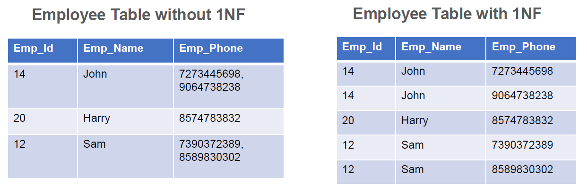
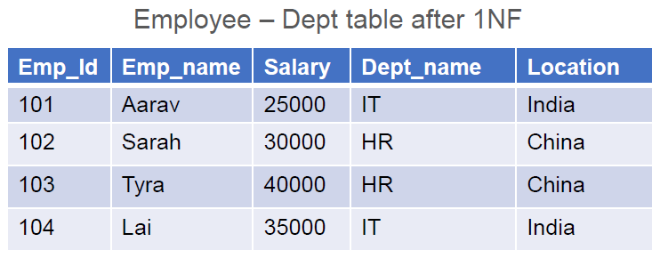
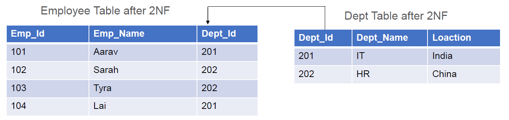
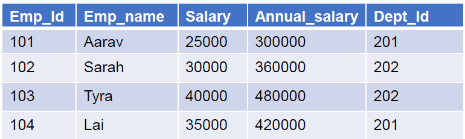
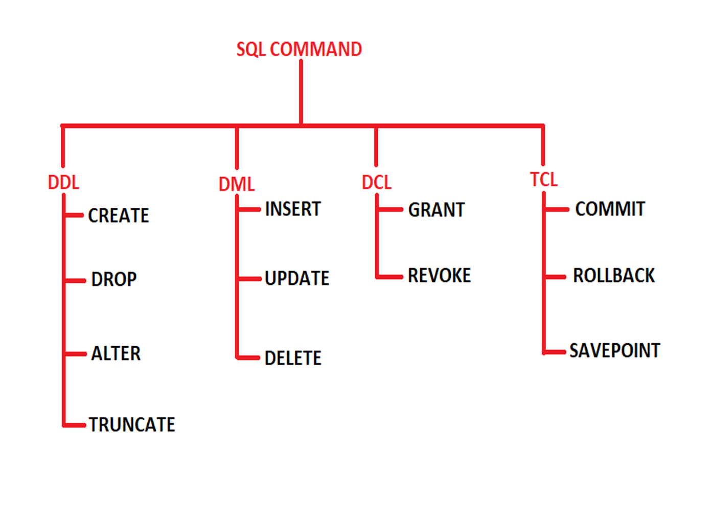
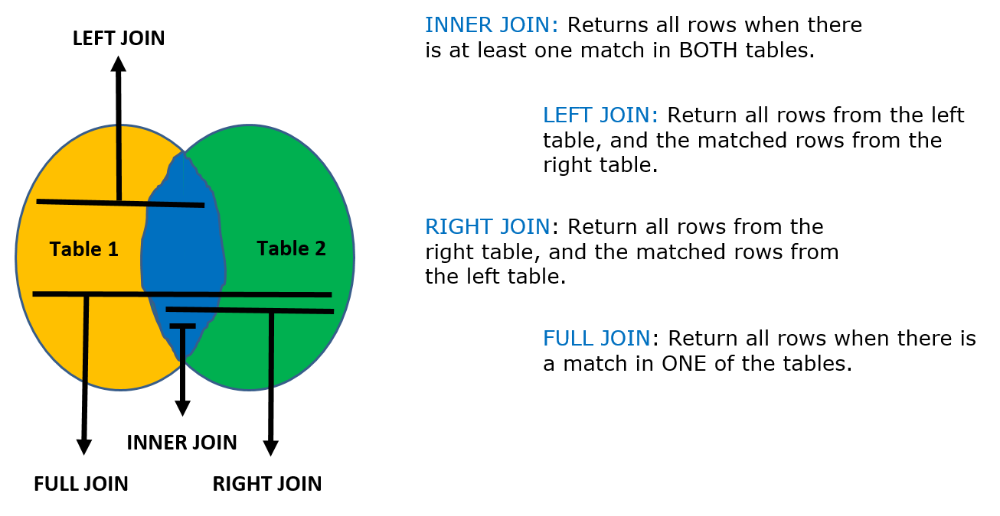

# Databases and PostgreSQL

## Basic Database Models & ER Diagram (Conceptual)

**What is a Database?**

- A database is a structured collection of data stored in tables.
- Each table has rows (records) and columns (fields/attributes).

**Why Database Models?**

- To organize data logically.
- To remove duplication and confusion.

**DBMS:**

- A database is an organized collection of structured information or data stored in a computer system.
- A database is usually controlled by a DBMS.
- Database Management Systems (DBMS) are software systems used to store, retrieve, and run queries on data.
- A DBMS serves as an interface between an end user and a database.

**RDBMS:**

- A Relational database management system (RDBMS) is a database management system (DBMS) that is based on the relational model.
- Examples
  - SQL
  - MS SQL Server
  - PostgreSQL
  - ORACLE
  - MySQL
  - Microsoft Access, etc..

**Terminologies:**

- Schema

  - Schema is a collection of one or more tables of data.

- Table or Relation
  - The RDBMS database uses tables to store data.
  - A table is a collection of related data entries and contains rows and columns to store data.
  - Each table represents some real world objects such as person, place, or event about which information is collected.


- Rows or Record or Tuple
  - a single group of related data within a table


- Column or Field or Attribute
  - A column is a list of values, usually belonging to a particular field, displayed vertically in a table.
  - In Customer table, Customer_Id , Customer_Name , Age and Location are the columns


- Data value
  - information which database just stores.

**ER Diagram (Entity-Relationship Diagram):**

- A picture/model of how data relates.
- Entity → Real-world object (Student, Course).
- Attribute → Properties of an entity (name, age).
- Relationship → How entities connect (Student enrolls in Course).

**Symbols Used in ER Model:**

- ER Model is used to model the logical view of the system from a data perspective which consists of these symbols:

  - Rectangles: Rectangles represent entities in the ER Model.
  - Ellipses: Ellipses represent attributes in the ER Model.
  - Diamond: Diamonds represent relationships among Entities.
  - Lines: Lines represent attributes to entities and entity sets with other relationship types.
  - Double Ellipse: Double ellipses represent multi-valued Attributes, such as a student's multiple phone numbers
  - Double Rectangle: Represents weak entities, which depend on other entities for identification.


**Reference Links for ERD Understanding:**

- [Lucidchart](https://www.lucidchart.com/pages/er-diagrams)
- [Visual Paradigm](https://www.visual-paradigm.com/guide/data-modeling/what-is-entity-relationship-diagram/)
- [Smart Draw](https://www.smartdraw.com/entity-relationship-diagram/)
- [Geeks For Geeks](https://www.geeksforgeeks.org/dbms/introduction-of-er-model/)

## Normalization

- Normalization is the process of organizing the data in the database.
- Normalization is used to minimize the redundancy from a relation or set of relations.
- It is also used to eliminate undesirable characteristics like Insertion, Update, and Deletion Anomalies.
- Normalization divides the larger table into smaller and links them using relationships.

**First Normal Form (1NF):**

- A relation will be 1NF if it contains an atomic value.
- It states that an attribute of a table cannot hold multiple values. It must hold only single valued attribute.
- First Normal Form (1NF) does not eliminate redundancy, but rather, it’s that it eliminates repeating groups



**Second Normal Form (2NF):**

A table is said to be in 2NF -

- if the table meets all the conditions of 1NF
- Move redundant data to a separate table
- Create relationship between these tables using foreign keys.



we need to break the table into 2, and move the redundant department data (DeptName, and Location) into it's own table. To link the tables with each other, we use the DeptId foreign key. The tables below are in 2NF.



**Third Normal Form (3NF)**

A table is said to be in 3NF -

- if the table meets all the conditions of 1NF and 2NF
- Does not contain columns (attributes) that are not fully dependent upon the primary key

The AnnualSalary is also dependent on the Salary column. In fact, to compute the AnnualSalary , we multiply the Salary by 12. Since AnnualSalary is not fully dependent on the primary key, and it can be computed, we can remove this column from the table, which then, will adhere to 3NF.



## CRUD operations and Transaction Statements (Queries)



```sql
-- Create
CREATE TABLE student(studentId int, fullName varchar, gender varchar, age int, scores int)

-- Insert
INSERT INTO student VALUES(120,'Ram','Male',21, 85),(121,'Sanju','Female',22, 90)
,(122, 'Kim','Female',22,87),(123, 'Kenna','Female',21,75),(124, 'Zion','Male', 20, 88)

-- Update
UPDATE student SET age = 21 WHERE studentid = 121
UPDATE student SET age = 21 WHERE studentid = (SELECT studentid FROM student WHERE fullname = 'Sanju')

-- Delete
DELETE FROM student WHERE fullname = 'Kim'

-- Opertators as Keywords : "BETWEEN AND", "IN" & "LIKE"

-- BETWEEN AND (we define range and numbers are inclusive)
SELECT * FROM student WHERE scores BETWEEN 85 AND 90
SELECT * FROM student WHERE scores NOT BETWEEN 82 AND 90

-- IN (not a range, only the exact values)
SELECT * FROM student WHERE age IN (20,21)
SELECT * FROM student WHERE age NOT IN (20,21)

INSERT INTO student VALUES(125,'Ritwik','Male',29, 100)

-- LIKE (% : Matches zero or more char, _ : Matches exactly one char)
SELECT * FROM student WHERE fullname LIKE 'R%'
SELECT * FROM student WHERE fullname LIKE '_a_'

--Aggregate functions: MIN, MAX, COUNT, SUM, AVG

--The * is counting all the rows
SELECT COUNT(*) FROM student
SELECT COUNT(age) FROM student
SELECT MIN(age) AS minimumAge FROM student
SELECT MAX(age) FROM student
SELECT SUM(scores) sumOfScores FROM student
SELECT AVG(scores) FROM student

-- Clauses: WHERE, GROUP BY, ORDER BY, HAVING
SELECT * FROM student ORDER BY age -- Default Acending
SELECT * FROM student ORDER BY age DESC

-- Write a query to display age and the lowest scores scored by each unique aged student (ex: all aged 21 having lowest score which is 75 )
SELECT age, MIN(scores) FROM student GROUP BY age

-- Write a query to display gender and highest scores scored by a unqiue gender
SELECT gender, MAX(scores) FROM student GROUP BY gender

-- Write a query to display age and count of age for all students whose age is equal to 21
SELECT age, COUNT(age) FROM student WHERE age=21 GROUP BY age
SELECT age, COUNT(age) FROM student WHERE age=21 -- This does not work because GROUP BY is often used with aggreate fucntion and this doesn't have group by

-- Write a query to display age and max scores scored by each age student
SELECT age, MAX(scores) FROM student GROUP BY age

-- Syntax: SFWGHO (shout for work going home office)

-- SELECT column name
-- FROM table name
-- WHERE condition
-- GROUP BY column name
-- HAVING condition
-- ORDER BY column name

-- Difference between WHERE & HAVING - WHERE cannot work with aggregate functions but HAVING can

-- Write a query to display age and the max scores scored by each unique aged student whose max scores are greater than 85
SELECT age, MAX(scores) FROM student GROUP by (age) HAVING MAX(scores) >85

-- Write a query to display age and the max scores scored by al students whose age is greater than 20 and having a max score of greater than 85 for each age, while displaying the data in ascending order with respect to age
SELECT age, MAX(scores) FROM student WHERE age > 20 GROUP BY(age) HAVING MAX(scores) >85 ORDER BY age

-- Subquery/Nested Subquery:

-- Write a query to display student id, name and gender of all students whose scores are more than zion's score
SELECT studentid,fullname,gender FROM student WHERE scores > (SELECT scores FROM student WHERE fullname = 'Zion')

-- Write a query to display name, age whose age is equal to student named 'Kenna' and scores is greater than student named RAM
SELECT fullname, age
FROM student
WHERE age = (SELECT age FROM student WHERE fullname = 'Kenna')
AND scores > (SELECT scores FROM student WHERE fullname = 'Ram')

-- Subqueries with IN operator
SELECT studentid FROM student WHERE age IN (SELECT age FROM student WHERE age > 21)

-- Selection
SELECT * FROM student

-- JOINS in SQL

-- Creating two tables to work with Joins
CREATE TABLE employee(emp_id int , fullname varchar,gender varchar, age int, salary int )

INSERT INTO employee VALUES( 206,'aman','male',24,350000),( 208,'tanisha','female',27,460000),( 203,'harpreet','female',29,890000)

CREATE TABLE emp_dept(dept_id int,emp_id int, deptName varchar,city varchar, pincode int)

INSERT INTO emp_dept VALUES(23,206,'developer','pune',201482),(23,203,'developer','delhi',345267),(22,210,'analyst','mumbai',987654)

SELECT * FROM employee

SELECT * FROM emp_dept

-- JOIN(INNER JOIN)

-- ON keyword matches with the one common field given
SELECT * FROM employee INNER JOIN emp_dept ON employee.emp_id = emp_dept.emp_id -- (with JOIN) This performs better
SELECT * FROM employee, emp_dept WHERE employee.emp_id = emp_dept.emp_id -- (without JOIN) However this still works

-- LEFT JOIN(LEFT OUTER JOIN): Left table is the left one in the query
SELECT * FROM employee LEFT JOIN emp_dept ON employee.emp_id = emp_dept.emp_id

-- RIGHT JOIN(RIGHT OUTER JOIN): right table is the right one in the query
SELECT * FROM employee RIGHT OUTER JOIN emp_dept ON employee.emp_id = emp_dept.emp_id

-- FULL JOIN(FULL OUTER JOIN):
SELECT * FROM employee FULL OUTER JOIN emp_dept ON employee.emp_id = emp_dept.emp_id

-- NATURAL JOIN: Automatically finds the common column - doesnt need a condition and also resultant table will have only one common column (emp_id)
SELECT * FROM employee NATURAL JOIN emp_dept
SELECT * FROM employee NATURAL LEFT JOIN emp_dept
SELECT * FROM employee NATURAL RIGHT JOIN emp_dept
SELECT * FROM employee NATURAL FULL JOIN emp_dept

-- DROP a table - drops the complete table with data and schema
DROP TABLE animals

-- Add a new column in the table
ALTER TABLE student ADD attendances int

-- Modify existing column in the table
ALTER TABLE student ALTER COLUMN attendances TYPE varchar

-- Rename existing column in the table
ALTER TABLE student RENAME COLUMN attendances TO tardies

-- Rename the table name
ALTER TABLE student RENAME TO students

-- Delete one of the column from students table
ALTER TABLE students DROP COLUMN tardies

-- TRUNCATE - this will delete data and not the schema
TRUNCATE TABLE students

-- DELETE - deleting a specific data or a particular cell
DELETE FROM emp_dept where emp_id = 206
DELETE FROM emp_dept; -- works like truncate - delete the complete data but schema will remain

-- TCL
-- TCL commands can only be used with DML commands like INSERT, DELETE and UPDATE only.
-- These operations are automatically committed in the database that's why they cannot be used while creating tables or dropping them.

-- ROLLBACK
-- Rollback command is used to undo transactions that have not already been saved to the database.
-- COMMIT
-- Commit command is used to save all the transactions to the database.
-- (disable the autocommit for doing operations with ROLLBACK and COMMIT)
UPDATE employee SET salary = 500000 WHERE fullname ='aman'
ROLLBACK;
SELECT * FROM employee
COMMIT;

-- SAVEPOINT (disable the autocommit)
-- It is used to roll the transaction back to a certain point without rolling back the entire transaction. It is to divide the transaction into smaller sections. It defines breakpoints for a transaction to allow partial rollback.
UPDATE employee SET salary = 500000 WHERE fullname ='harpreet';
SAVEPOINT sp1;
UPDATE employee SET salary = 500000 WHERE fullname ='tanisha';
SAVEPOINT sp2;
UPDATE employee SET salary = 600000 WHERE fullname ='aman';
SAVEPOINT sp3;

ROLLBACK TO SAVEPOINT sp1;

-- How to JOIN 3 tables in SQL?
SELECT EMPLOYEE.EMP_FIRSTNAME, EMPLOYEE.EMP_LASTNAME,
DEPARTMENT.DEPT_NAME
FROM EMPLOYEE
JOIN EMP_DEPT
ON EMPLOYEE.EMP_ID = EMP_DEPT.EMP_ID
JOIN DEPARTMENT
ON DEPARTMENT.EMP_ID = EMP_DEPT.EMP_ID
```

## Joins in SQL



## Indexing Basics

**What is Index?**

Like an index in a book → makes searches faster.

**Example:**

```sql
-- Create index
CREATE INDEX idx_students_age ON students(age);
```

- Too many indexes slow down INSERT/UPDATE, so use wisely.

## Loading Data into PostgreSQL

**Example:**

```sql
-- Load data from CSV
COPY students(id, name, age)
FROM '/path/students.csv'
DELIMITER ','
CSV HEADER;
```

## JDBC Overview - Driver, Connection, Statement, DriverManager, Performing CRUD via JDBC

JDBC (Java Database Connectivity) → Connect Java to DB.

Steps to connect Java to Database/Main Components:

1. Register the Driver - DriverManager → Loads driver.
2. Establish the Connection - Connection → Connect to DB.
3. Write the Query - Statement / PreparedStatement / Callable Statement → Run SQL.
4. Read the result - ResultSet → Read results using a loop.
5. Close the Connection

```java
package com.jdbcexample;

import java.io.BufferedReader;
import java.io.FileInputStream;
import java.io.InputStreamReader;
import java.sql.Connection;
import java.sql.DriverManager;
import java.sql.PreparedStatement;
import java.sql.ResultSet;
import java.sql.Statement;

public class JDBCExample {

  public static void main(String[] args) {

	  try {
		  //first step - register the driver
		  Class.forName("org.postgresql.Driver");

          //second step - establish the connection
		  String url = "jdbc:postgresql://localhost:5432/sapientdb";
		  String username = "postgres";
		  String password = "root";

		  Connection con = DriverManager.getConnection(url, username, password);

		  if(con.isClosed()) {
			  System.out.println("Connection is closed");
		  }else {
			  System.out.println("Connection created....");
		  }

		  //third step - writing queries (create, insert, update, delete)

		  //creating a table
		  String q = "create table table1(tId int(20) primary key auto_increment, tName varchar(200) not null, tCity varchar(400))";
		  Statement stmt = con.createStatement();
		  stmt.executeUpdate(q);
		  System.out.println("Table created in the database...");

		  //inserting new record
		  String q1 = "insert into table1(tName, tCity) values(?, ?)";
		  PreparedStatement pstmt = con.prepareStatement(q1);
		  pstmt.setString(1, "Ritwik");
		  pstmt.setString(2, "Mumbai");
		  pstmt.executeUpdate();

		  //dynamic insertion of new records
		  String q2 = "insert into table1(tName, tCity) values(?, ?)";
		  BufferedReader br = new BufferedReader(new InputStreamReader(System.in));
		  System.out.println("Enter Name: ");
		  String name = br.readLine();
		  System.out.println("Enter City: ");
		  String city = br.readLine();
		  PreparedStatement pstmt1 = con.prepareStatement(q2);
		  pstmt1.setString(1, name);
		  pstmt1.setString(2, city);
		  pstmt1.executeUpdate();

		  //insertion of images
		  String q3 = "insert into images(pic) values(?)";
		  PreparedStatement pstmt2 = con.prepareStatement(q3);
		  FileInputStream fis = new FileInputStream("mypic.jpg");
		  pstmt2.setBinaryStream(1, fis, fis.available());
		  pstmt2.executeUpdate();
		  System.out.println("Pic Inserted");

		  //updating the existing record
		  String q4 = "update table1 set tName=?, tCity=? where tId=?";
		  BufferedReader br1 = new BufferedReader(new InputStreamReader(System.in));
		  System.out.println("Enter new name: ");
		  String name1 = br.readLine();
		  System.out.println("Enter new city: ");
		  String city1 = br.readLine();
		  System.out.println("Enter the student id: ");
		  int id = Integer.parseInt(br1.readLine());
		  PreparedStatement pstmt3 = con.prepareStatement(q4);
		  pstmt3.setString(1, name1);
		  pstmt3.setString(2, city1);
		  pstmt3.setInt(3, id);
		  pstmt3.executeUpdate();
		  System.out.println("Done.........");

		  //fourth step - reading the data (selection)
		  String q5 = "select * from table1";
		  Statement stmt1 = con.createStatement();
		  ResultSet set = stmt.executeQuery(q5);
		  while(set.next()) {
			  int id2 = set.getInt("tId");
			  String name2 = set.getString("tName");
			  String city2 = set.getString("tCity");
			  System.out.println(id2 + " :" + name2 +" :" + city2);
		  }
		  System.out.println("Done.........");

		  //fifth step - close the connection
		  con.close();

	} catch (Exception e) {
		System.out.println(e);
	}
  }
}
```
