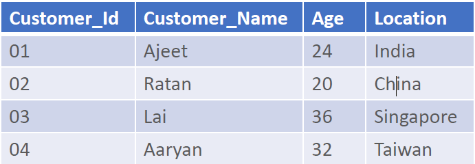
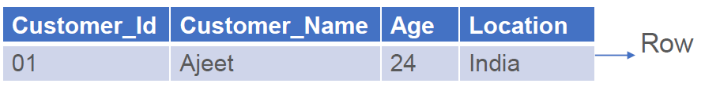
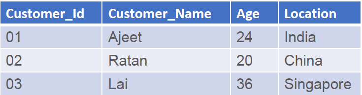

# Databases and PostgreSQL

## Basic Database Models & ER Diagram (Conceptual)

**What is a Database?**

- A database is a structured collection of data stored in tables.
- Each table has rows (records) and columns (fields/attributes).

**Why Database Models?**

- To organize data logically.
- To remove duplication and confusion.

**DBMS:**

- A database is an organized collection of structured information or data stored in a computer system.
- A database is usually controlled by a DBMS.
- Database Management Systems (DBMS) are software systems used to store, retrieve, and run queries on data.
- A DBMS serves as an interface between an end user and a database.

**RDBMS:**

- A Relational database management system (RDBMS) is a database management system (DBMS) that is based on the relational model.
- Examples
  - SQL
  - MS SQL Server
  - PostgreSQL
  - ORACLE
  - MySQL
  - Microsoft Access, etc..

**Terminologies:**

- Schema

  - Schema is a collection of one or more tables of data.

- Table or Relation
  - The RDBMS database uses tables to store data.
  - A table is a collection of related data entries and contains rows and columns to store data.
  - Each table represents some real world objects such as person, place, or event about which information is collected.

- Rows or Record or Tuple
  - a single group of related data within a table

- Column or Field or Attribute
  - A column is a list of values, usually belonging to a particular field, displayed vertically in a table.
  - In Customer table, Customer_Id , Customer_Name , Age and Location are the columns

- Data value
  - information which database just stores.

**ER Diagram (Entity-Relationship Diagram):**

- A picture/model of how data relates.
- Entity → Real-world object (Student, Course).
- Attribute → Properties of an entity (name, age).
- Relationship → How entities connect (Student enrolls in Course).

**Example:**
Entities: Student (id, name, email) and Course (id, name, credits)
Relationship: Student Enrolls in Course (many-to-many).
