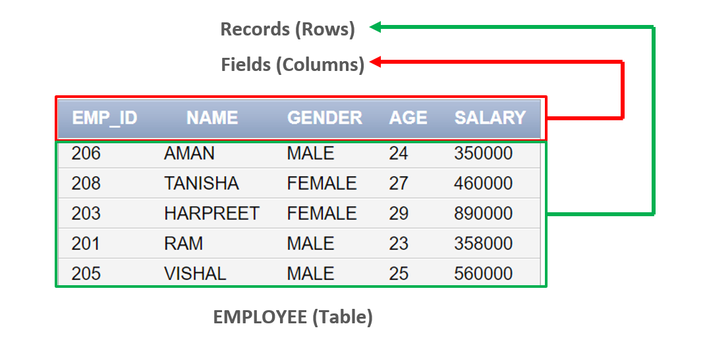
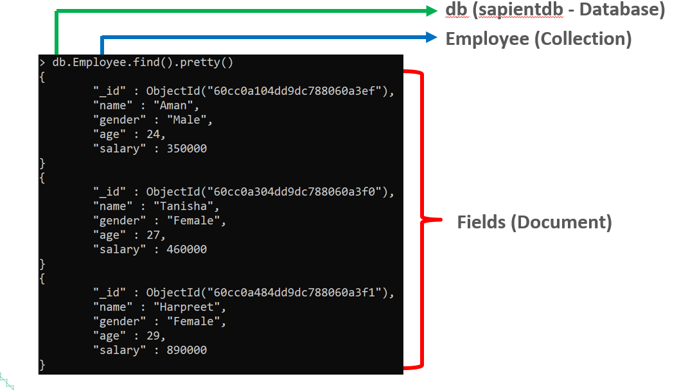

# Databases and MongoDB

## Limitations of RDBMS

1. In relational database we need to define structure and schema of data first and then only we can process the data.

2. Relational database systems provides consistency and integrity of data by enforcing ACID properties (Atomicity, Consistency, Isolation and Durability ). However in most of the other cases these properties are significant performance overhead and can make your database response very slow.

3. Most of the applications store their data in JSON format and RDBMS don’t provide you a better way of performing operations such as create, insert, update, delete etc on this data.

## What is NoSQL Database?

1. Not Only SQL (NoSQL) or non relational databases provides a mechanism for storage and retrieval of data other than tabular relations model used in relational databases. 

2. NoSQL database doesn't use tables for storing data. It is generally used to store big data and real-time web applications.

## Why NoSQL Database?

- NoSQL databases were created in response to the limitations of traditional relational database technology.

- When compared against relational databases, NoSQL databases are more scalable and provide superior performance, and their data model addresses several shortcomings of the relational model.

- Relational databases (SQL) are good for structured, tabular data, but modern apps (social media, IoT, e-commerce) handle huge, flexible, and unstructured data (JSON, images, logs). NoSQL is faster, scalable, flexible schema.

- The advantages of NoSQL include being able to handle:
  - Large volumes of structured, semi-structured, and unstructured data
  - Agile sprints, quick iteration, and frequent code pushes
  - Object-oriented programming that is easy to use and flexible
  - Efficient, scale-out architecture instead of expensive, monolithic architecture

## When to use NoSQL Database?

- When you want to store and retrieve huge amount of data.
- The relationship between the data you store is not that important
- The data is not structured and changing over time
- Constraints and Joins support is not required at database level
- The data is growing continuously and you need to scale the database regular to handle the data.

## Where to use NoSQL Database?

- Data isn't relational (e.g. Documents)
- Too much data to fit in a relational database

## How NoSQL stores data?

Stores data in different models → Documents, Key-Value pairs, Graphs, Columns.

**Example (JSON document in MongoDB):**

```json
{
  "id": 1,
  "name": "Alice",
  "age": 22,
  "skills": ["Java", "MongoDB"]
}
```

## Types of NoSQL Databases

1. Document Store (Focus)

- Stores data as JSON-like documents.
- Flexible, human-readable.
- Example: MongoDB, CouchDB.

2. Key-Value Store

- Simple dictionary-like structure.
- Example: Redis.

3. Graph Database

- Stores nodes & edges (great for social networks).
- Example: Neo4j.

4. Column Store

- Stores data in columns (efficient for analytics).
- Example: Cassandra.

## CAP Theorem vs ACID Properties

### ACID (Traditional Databases like SQL)

**What is ACID?**

- It describes how transactions in databases should behave to keep data safe and correct.

**A – Atomicity**

- All-or-nothing.
- Either the whole transaction happens or nothing happens.

- Example: Money transfer (₹100 from A to B) → Deduct from A and add to B, not just one.

**C – Consistency**

- Data must follow rules.
- After a transaction, the database should still make sense.

- Example: A student’s age cannot suddenly be negative.

**I – Isolation**

- Multiple users doing things at the same time should not interfere.

- Example: Two people booking the same seat online → only one should succeed.

**D – Durability**

- Once saved, it’s permanent (even if server crashes).

**Why ACID?** → Ensures correctness, safety, and trust in banking, ERP, inventory systems.

### CAP Theorem (Distributed / NoSQL Databases)

**What is CAP?**

- It explains the limitations of distributed databases (databases spread across multiple servers).

**C – Consistency**

- All nodes should show the same data at the same time.

- Example: If you update your profile picture, all servers should reflect it immediately.

**A – Availability**

- System should always respond, even if some parts are down.

- Example: If one server fails, others still answer your queries.

**P – Partition Tolerance**

- System should keep working even if communication between servers is broken.

- Example: In case of network issues, the system must not collapse.

**Rule:** You can only guarantee two out of three at any moment → CA, AP, or CP.

### Key Differences

| Feature    | **ACID (SQL)**                         | **CAP (NoSQL)**                                                |
| ---------- | ---------------------------------------- | ---------------------------------------------------------------- |
| Focus      | Transactions (single database)           | Distributed systems (multiple servers)                           |
| Purpose    | Keep data safe & correct                 | Handle scale, speed, failures                                    |
| Guarantees | **All 4 (A, C, I, D)**                   | Only **2 of 3 (C, A, P)**                                        |
| Example DB | MySQL, PostgreSQL, Oracle                | MongoDB, Cassandra, CouchDB                                      |
| Analogy    | Bank transactions (must be 100% correct) | Social media feed (better to be fast, even if slightly outdated) |

### Quick Analogy

ACID → Think of a bank. Every transaction must be 100% correct, even if it’s a bit slower.
Use Cases → Banking, Finance, Inventory, Healthcare (where correctness > speed). 

CAP → Think of Facebook/Instagram. Better to show posts fast, even if some are slightly old (eventual consistency).
Use Cases → Social media, E-commerce catalogs, IoT, Big Data (where scale + availability > strict consistency).

## Why MongoDB? – Use Cases

**Why MongoDB?**

- Schema-less → Flexible documents.
- Scales easily across servers.
- Easy to learn (JSON style).
- Strong developer community.

**Use Cases:**

- E-commerce product catalog.
- User profiles in apps.
- Real-time analytics.
- Content management systems.

## Setup & Creating Collections

### SQL



### NoSQL



### Setup and Creating Collections

Steps:

- Install MongoDB (Community Edition - Compass).
- Start MongoDB service.
- Open Mongo Shell (mongosh or mongo)

```javascript
// Show all databases
show dbs;

// Create/switch database - if the database doesn't exists, above command creates a new database otherwise opens the existing one.
use sapientdb;

// Create a collection
db.createCollection("students");

// Check collections - won't show until there is atleast one document inserted
show collections;

// Delete/Drop a database
db.dropDatabase()
// or db.collection_name.drop()
```

## CRUD Operations

```javascript
// Create/Insert

// In MongoDB you need not to create collection before you insert document in it. With a single command you can insert a document in the collection and the MongoDB creates that collection on the fly.

// Syntax: db.collection_name.insert({key:value, key:value…})

db.students.insertOne({name:"Ritwik", company:"Sapient", age:29, course: "Java"});

db.students.insertMany([
  { name: "Bob", company:"Sapient", age: 25, course: "Python" },
  { name: "Charlie", company:"Sapient", age: 23, course: "MongoDB" }
]);

// We can also create collection before we actually insert data in it. This method provides you the options that you can set while creating a collection.

// Syntax: db.createCollection(name, options)

// name is the collection name
// options is an optional field that we can use to specify certain parameters such as size, max number of documents etc. in the collection.

db.createCollection("employees");

// MongoDB stores data records as BSON documents. BSON is a binary representation of JSON documents.
```

## Query Modifiers: limit, skip, sort
## Indexing Overview: Single Field & Compound
## Aggregation Basics ($match, $group, $project)
## Java Integration (brief intro with MongoDB driver)