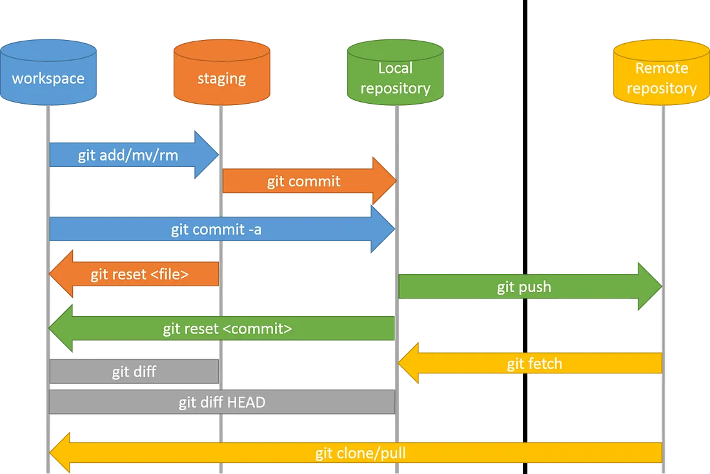
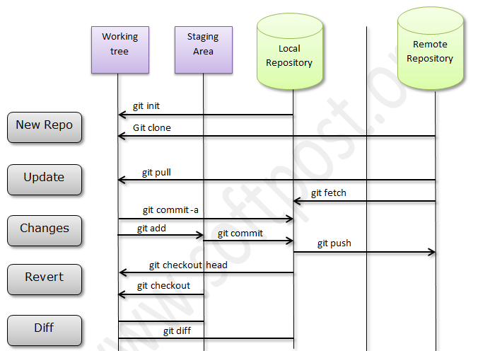

# Introduction

## Version Control

Version control is the practice of tracking and managing changes to your software code over time. It helps teams collaborate, monitor history, and recover from mistakes.

## Version Control System (VCS)
 
A Version Control System is a tool that records every modification made to your codebase. It enables collaboration, rollback of changes, and structured development workflows.

## What is Git?

Git is a widely-used version control system that allows developers to store code, track changes, and collaborate efficiently. It supports branching, merging, and provides a detailed history of code changes.

**Git helps developers:**

- Coordinate work across teams
- Revert to previous states
- Manage parallel development through branches

## Advantages of Git

- **Time-Saving**: Speeds up development by streamlining collaboration
- **Offline Access**: Most operations (like commit, diff, and history) work locally
- **Mistake Recovery**: Easily revert to earlier code versions
- **Change Tracking**: Keeps a detailed history of who changed what and when

## Key Features of Git

- **Open Source**: Freely available and community-supported
- **Scalable**: Efficiently handles large repositories and teams
- **Distributed Architecture**: Every user has a full copy of the repository, enabling independent work
- **Security**: Uses SHA-1 hash for data integrity and object identification
- **Speed**: Local operations like commits and diffs are extremely fast
- **Powerful Branching & Merging**: Supports parallel development and collaboration
- **Staging Area**: Offers a snapshot of changes before committing, allowing fine-grained control

---

# Git Architecture

*reference diagram 1*



*reference diagram 2*


## GitHub vs Bitbucket

- GitHub: Repositories are **public by default**; ideal for open-source projects.
- Bitbucket: Repositories are **private by default**; better for private codebases.

---

# Git Commands

## Basic Git Setup

- `git --version`  
  → Displays the currently installed Git version.

- `git config --global user.name "Ritwik"`  
  → Sets your global Git username.

- `git config --global user.email ritwik@gmail.com`  
  → Sets your global Git email.

- `git config --list`  
  → Shows all the Git configurations in effect.

- `git config --global --edit`  
  → Opens a file to manually edit global Git settings.

- `git config --global core.editor "code --wait"`  
  → Configures Visual Studio Code as the default Git editor, where `--wait` tells Git to wait until the file is closed before continuing.

- `git config --global --replace-all user.name "Ritwik Raj"`  
  → Updates your Git username globally by replacing any existing user.name setting; `--replace-all` ensures the value is fully overwritten.

---

## Repository Initialization & Status

- `git init`  
  → Initializes a new Git repository in the current directory.

- `git status`  
  → Shows the current state of files (staged, unstaged, untracked).

---

## Staging Changes

- `git add filename`  
  → Adds the specified file to the staging area.

- `git add .`  
  → Adds all modified and new files in the current directory to staging.

- `git add -A`  
  → Stages all changes (including deletions); `-A` = All changes (modified, new, deleted).

---

## Undoing Changes

- `git checkout filename`  
  → Discards local changes to a specific file.

- `git checkout <commit-hash>`  
  → Checks out a previous commit by its hash (detached head).

---

## Committing Changes

- `git commit -m "first commit"`  
  → Commits staged changes with a message; `-m` = message.

---

## Viewing Changes

- `git diff`  
  → Shows differences between working directory and staging area (unstaged changes).

- `git diff --staged`  
  → Shows differences between staging area and last commit.

- `git diff HEAD`  
  → Shows differences between working directory and the last commit.

---

## Viewing Commit History & Info

- `git show`  
  → Displays details about a specific Git object (like a commit).

- `git log`  
  → Lists commit history with author, date, and message.

- `git log -p -2`  
  → Shows changes (patches) for the last 2 commits; `-p` = patch format, `-2` = last 2 commits.

- `git log --stat`  
  → Shows commit history with summary of file changes.

- `git log --oneline`  
  → Shows the commit history in a compact, one-line-per-commit format; useful for quickly identifying commit IDs.

---

## Removing Files

- `git rm contact.html`  
  → Removes a file from the working directory and stages the deletion.

- `git rm -f index.html`  
  → Forcefully removes a file and stages it; `-f` = force.

- `git rm --cached about.html`  
  → Unstages a file without deleting it from the working directory; `--cached` = remove from staging area only.

---

## Branching & Navigation

- `git branch --list`  
  → Lists all local branches.

- `git branch login`  
  → Creates a new branch named login.

- `git checkout login`  
  → Switches to the login branch.

- `git checkout -b register`  
  → Creates and switches to a new branch register in one step; `-b` = branch.

- `git branch -d login`  
  → Deletes the login branch (only if merged); `-d` = delete.

- `git branch -D logout`  
  → Force deletes the logout branch (even if unmerged); `-D` = force delete.

- `git branch -vv`  
  → Lists all local branches along with the remote branch each one is tracking; `-vv` = verbose twice, for extra tracking info.

---

## Merging Branches

- `git checkout master`  
  → Switches to the master branch (you must be here to merge into it).

- `git merge login`  
  → Merges the login branch into the current branch (here: master).

Note: Always switch to the branch you want to merge into (typically master or main).

---

## Working with Files

- `rm register.html`  
  → Deletes the register.html file from your working directory (outside Git).

- `.gitignore`  
  → A special file used to tell Git which files or folders to ignore (not track).

---

## Combining Staging & Committing

- `git add -A && git commit -m "final commit"`  
  → Stages all changes and commits them with a message in one command; `-A` = all changes, `-m` = commit message.

---

## Managing Remote Repositories

- `git remote add origin https://bitbucket...`  
  → Adds a remote repository URL and names it origin, which Git will use to push/pull code.

- `git remote -v`  
  → Lists all remote repositories configured for your project, along with their URLs.

- `git push -u -f origin master`  
  → Pushes the local master branch to origin, using:  
    `-u` to set upstream tracking,  
    `-f` to force-push changes if needed.

- `git push --set-upstream origin test-branch`  
  → Pushes test-branch to the remote and sets it to track that remote branch going forward.

---

## Fetching & Syncing

- `git fetch --all`  
  → Fetches all changes from all remote repositories without merging them; `--all` ensures it fetches from every configured remote.

- `git branch -r`  
  → Lists all remote branches available in the repository.

---

## Deleting Remote Branches

- `git push -d origin feature/test-branch`  
  → Deletes the remote branch `feature/test-branch` from the origin remote; `-d` is short for delete.

---

## Reverting

- `git revert <commit-id>`  
  → Reverts the changes introduced by the specified commit and creates a new commit to undo it.

---

## Stashing Changes

- `git stash`  
  → Temporarily saves (stashes) your uncommitted changes, allowing you to work on something else without committing.

- `git stash list`  
  → Displays a list of all stashed changes in the order they were created.

- `git stash apply`  
  → Applies the most recent stashed change without removing it from the stash list.

- `git stash save`  
  → Saves your current changes as a new stash entry (older syntax; equivalent to `git stash push`).

- `git stash clear`  
  → Deletes all stash entries permanently.

- `git stash apply <stash@{n}>` (e.g. `git stash apply stash@{1}`)  
  → Applies a specific stash entry based on its index in the stash list.

---

# Key Focus Areas for the Production Phase
**What Project Leaders/SMEs look for in a real client standard project:**

## 1. Thoughtful Branching Model Selection

- Teams must collaboratively decide on a suitable Git branching strategy (e.g., Git Flow, GitHub Flow, Trunk-Based). 
- The rationale behind the choice must be clearly documented. 
- Think ahead — consider scenarios like parallel development, hotfixes, patch releases, and rollback situations. 
*Switching models mid-project is risky and discouraged.*

## 2. Well-Designed Branching Strategy & Workflow

- Visualize and share a clear diagram or outline showing: 
  - **Main branches** (e.g., main, develop) 
  - **Supporting branches** (e.g., feature/*, release/*, hotfix/*) 
  - **Branch lifecycle** and merge paths between them 
- Define team-wide policies for when and how to create, merge, and delete branches. 

## 3. Team-Wide Naming Conventions

- Decide and **enforce consistent naming patterns** for: 
  - Feature branches (e.g., feature/user-login) 
  - Sub-features or tasks (e.g., feature/login/validation) 
  - Hotfixes (e.g., hotfix/crash-on-start) 
  - Releases (e.g., release/1.2.0) 
  - Tags (e.g., v1.2.0) 
- Avoid ad-hoc or personal styles. **Naming consistency = team clarity**. 

## 4. Mandatory Semantic Tagging After Each Sprint

- At the end of every sprint or major release: 
  - Create a **Git tag** using Semantic Versioning (e.g., v1.0.0, v1.1.0) 
  - Tags should mark stable milestones and help with rollback/debugging. 
  - Add release notes or tag messages summarizing key features/changes. 

## 5. Clear Conflict Resolution Guidelines

- Define a standard approach for resolving Git merge conflicts: 
  - Who owns the responsibility for resolving them? 
  - When should team members pull and rebase? 
  - How to avoid overwriting others’ work? 
- Encourage **communication before merging** and **reviewing conflicts as a team** when needed. 

## 6. Commit Hygiene

- Encourage developers to make **small, meaningful commits** with clear messages. 
- Follow conventional commit formats where possible (e.g., feat:, fix:, refactor:). 
- Avoid lumping multiple unrelated changes into a single commit.  

## 7. Review-Ready Branches

- Ensure all branches are **ready for review** before raising a pull request: 
  - Code should be linted, tested, and well-commented. 
  - PRs should include a **summary of changes**, context, and screenshots/logs if applicable. 
- Encourage peer reviews and early feedback loops. 

## 8. Team Synchronization & Git Hygiene

- Schedule regular sync-ups to align on: 
  - Merge schedules 
  - Branch cleanup 
  - Shared pain points (e.g., frequent conflicts or stale branches) 
- Use project tracking tools like **Jira, Trello, or GitHub Projects** to **map branches to tasks or stories** for better visibility and traceability. 

---

# How to Create a Pull Request (PR) in Bitbucket
*A step-by-step guide to propose, review, and merge your code effectively:*

## 1. Navigate to Your Repository
Open Bitbucket in your browser and go to the repository where you want to raise a PR.

## 2. Create a New Branch (If Not Already Created)
If your changes aren’t already in a dedicated branch:

- Navigate to the **"Branches"** tab in the repo and click **"Create branch"**
Or, from terminal:

```bash
git checkout -b <new-branch-name>
```

This creates and switches you to a new feature branch.

## 3. Make Code Changes and Commit Locally

Edit your files as needed. Once done, stage and commit the changes:

```bash
git add .
git commit -m "Describe your changes briefly"
```

## 4. Push Changes to Bitbucket

Push your local branch to the remote Bitbucket repository:

```bash
git push origin <your-branch-name>
```

## 5. Initiate a Pull Request (PR)

Back on Bitbucket:

- Go to the **“Pull requests”** tab of your repository.
- Click **“Create pull request.”**
- Choose:
  - **Source branch** (your feature branch)
  - **Destination branch** (typically `develop`, `main`, or `release`)
- Fill in:
  - A **clear title** summarizing your change
  - A **detailed description** explaining the context, scope, and impact of the change

## 6. Assign Reviewers (Mandatory Step)

You **must assign at least one reviewer** to every PR. This ensures code is peer-reviewed before merging.

**Reviewers are responsible for:**

- Ensuring the changes follow team conventions
- Reviewing code quality, security, and test coverage
- Leaving comments or suggestions if necessary

## 7. Address Feedback & Finalize Review

Reviewers may leave comments or request changes. Once:

- All comments are resolved
- All checks/tests (if any) pass
- Approval is granted by all required reviewers

→ You are ready to proceed.

## 8. Merge the Pull Request

Use the Bitbucket UI to **merge** the PR into the destination branch once it’s approved.

Choose the merge strategy your team prefers (e.g., merge commit, squash, rebase).

## 9. Close the PR

After merging, **close the PR** to mark it as complete. Bitbucket usually auto-closes merged PRs, but verify manually if needed.

---

# Branch Management Best Practices
*Effective collaboration, clean hostory, and streamlined delivery through thoughtful Git branching.*

## 1. Lifecycle Management

- Keep branches **short-lived** to reduce complexity and avoid divergence.
- **Merge or rebase frequently** with the mainline (`main`/`develop`) to stay updated.
- **Delete branches** after merging to keep the repository clean and focused.

## 2. Merging vs. Rebasing

- Prefer `rebase` over `merge` for feature branches to maintain a **linear and readable commit history**.
- Use `merge` for combining major completed branches (like `release` or `hotfix`) into `main`.
- Always **resolve conflicts locally** before pushing, especially when rebasing.

## 3. Conflict Resolution Strategy

- Encourage **early and frequent syncs** with target branches to minimize conflict risk.
- Use tools like **VS Code Merge Editor**, **GitKraken**, or `git rebase --interactive` for efficient resolution.
- Document conflict resolution rules (e.g., _keep server changes_, _override local_, etc.) as team guidelines.

## 4. Handling Long-Running Feature Branches

- **Split large features** into smaller, manageable branches or sub-tasks (`feature/login-ui`, `feature/login-api`).
- **Rebase frequently** from the base (`main` or `develop`) to reduce drift.
- Consider creating a temporary **integration branch** for testing large modules before final merge.

## 5. Synchronizing Between Branches

- When sharing progress across branches, **Rebase your branch** on top of the latest changes in the base branch instead of using merge commits.
- **Communicate actively** during rebase-heavy workflows to avoid overlapping or conflicting code logic.
- Use **tags or shared naming conventions** to trace synced features between long-running branches.

## 6. Additional Best Practices

- **Enforce branch protection rules** (e.g., prevent direct push to `main`, require PR approvals).
- **Adopt semantic naming** conventions: `feature/*`, `bugfix/*`, `hotfix/*`, `release/*`
- Make use of **draft PRs** to start discussions early, even before the feature is complete.
- Always include a **clear PR description and checklist** to support code reviewers.

---

# Resetting & Undoing Changes in Git

## Git Storage Areas:

- **Working Directory**: Your actual code files.
- **Staging Area (Index)**: Files marked to be committed.
- **Repository (HEAD/Commit History)**: The actual committed snapshots.

| Command | Scope | Effect |
|--------|-------|--------|
| `git checkout -- <file>` | Working Directory | Discards changes in file (reset to last committed state) |
| `git restore <file>` | Working Directory | Safe undo of file edits (modern alternative to checkout) |
| `git reset <file>` | Staging Area | Unstage file (keeps changes in working directory) |
| `git reset --soft HEAD~1` | Commit History (soft) | Undo last commit, keep changes staged |
| `git reset --mixed HEAD~1` | Commit History + Staging Area | Undo commit, keep files but unstage |
| `git reset --hard HEAD~1` | Everything | Dangerous – undo last commit and discard changes |
| `git revert <commit>` | Commit History | Safe – creates a new commit that undoes an old one |

### When to Use What?

| Scenario | Recommended Command |
|---------|----------------------|
| Edited file but want to discard changes | `git restore <file>` or `git checkout -- <file>` |
| Staged the wrong file | `git reset <file>` |
| Committed too early (but want to keep changes) | `git reset --soft HEAD~1` |
| UCommitted wrong files, want to redo | `git reset --mixed HEAD~1` |
| Want to permanently delete local work | `git reset --hard HEAD~1` |
| Want to undo a pushed commit (safely) | `git revert <commit>` |

### Understanding the risks - 

- reset --hard deletes code forever. Never use without backups. 
- Rewriting history (e.g., reset or rebase) after pushing will affect collaborators. 
- revert is safe for public history. 

### Layman Analogy - 

- **Soft reset** = unsending WhatsApp message but keeping it in draft.
- **Mixed reset** = unsending but keeping the text.
- **Hard reset** = deleting the message and the text.
- **Revert** = sending another message saying “ignore my last one.”

---

# .gitignore

## 1. Purpose of .gitignore

- Prevents unnecessary, sensitive, or system-specific files from being tracked by Git.
- Keeps the repository **clean, secure, and portable** across machines and developers.

## 2. What to Ignore?

```gitignore
# Build outputs
/dist
/build
/out

# Dependencies directories
/node_modules
/vendor
.venv

# Environment files
.env
.env.local
.env.production

# System & IDE files
.DS_Store
Thumbs.db
.vscode/
.idea/

# Log files
*.log
npm-debug.log

# Secrets or credentials - Any file with API keys, passwords, or tokens
*.key
*.pem
```

## 3. How to Use?

- Create a `.gitignore` file in your repo root.
- List file names, directory names, or wildcard patterns to ignore.

---

# Important Notes:

## git pull vs Pull Request

- `git pull` - I want to get the latest code from the remote repo to my local machine.
- **Pull Request (PR)** - I want my changes to be reviewed and merged into a remote branch (like main).

## git pull vs git fetch

| Command | What it Does | Safe? | Local Merge? |
|--------|----------------|-------|--------------|
| `git fetch` | Downloads changes from the remote but does NOT merge into your local branch | ✅ Safe | ❌ No |
| `git pull` | Fetches + Merges changes from the remote into your current branch | ⚠️ Risk of conflicts | ✅ Yes |

## git revert vs git reset

| Feature | `git revert` | `git reset` |
|--------|---------------|-------------|
| What it does | Creates a new commit that undoes a previous commit | Moves the HEAD and branch pointer to a previous commit |
| Safe for team use | ✅ Yes — keeps history intact | ⚠️ Not safe if changes are already pushed to shared remote |
| Usage | To undo a commit without rewriting history | To discard commits or change commit history locally |
| Keeps history | ✅ Yes | ❌ No - rewrites history |

## git stash pop vs git stash apply

| Command | What it Does | Deletes the Stash? | Use Case |
|--------|----------------|--------------------|-----------|
| `git stash apply` | Applies stashed changes, but keeps the stash in the list | ❌ No | When you want to reuse later |
| `git stash pop` | Applies stashed changes and then removes them from stash list | ✅ Yes | When you no longer need stash |

## Jira and Bitbucket Linking

### a. Native Integration via Atlassian Cloud

If both your Jira and Bitbucket accounts are under the **same Atlassian organization:** 

- The link is often automatic, or you can link manually from: 
  - Jira → Settings → Products → DVCS accounts → Link Bitbucket 

- **Steps**:

  - Go to **Jira → Settings → Products → DVCS accounts** 
  - Click Link Bitbucket Cloud 
  - Authorize your Bitbucket account 
  - Select repositories to sync 
  - Done! You’ll start seeing: 
    - Bitbucket activity under Jira issues 
    - Smart commits (git commit -m "PROJ-123 Fix bug") auto-linked 
    - Pull requests and build status on Jira cards 

### b. Smart Commits in Git

In commit messages, use Jira issue keys to auto-link and trigger actions: 
```bash
git commit -m "PROJ-101 Fix login bug #comment fixed null error #time 1h #done"
```

This can:
- Add comments to issues
- Log time
- Transition issue status

Works only if Bitbucket repo is linked to Jira (via DVCS accounts).

### c. Branch Naming Conventions

When you create branches like: 

```bash
feature/PROJ-123-add-login-form
```

Bitbucket automatically detects the Jira key (PROJ-123) and links it back to the Jira issue. 

---
