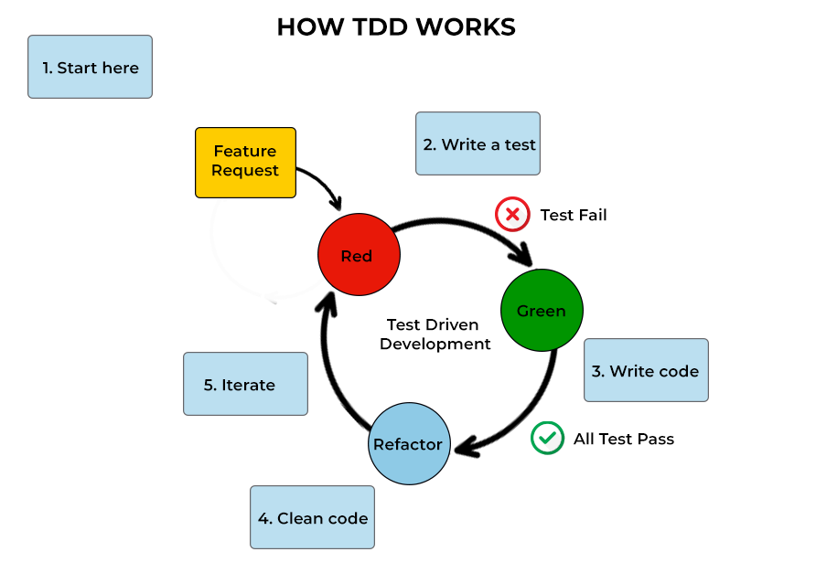

# Java Testing Essentials – JUnit 5 & Mockito

## What is Testing?

Testing is the process of checking if your code behaves as expected.

## Why Testing?

- Catches bugs early
- Ensures code works after changes
- Builds confidence to refactor or add features

## Types of Testing

- Unit Testing: Tests one small piece of code (usually one method).
- Integration Testing: Tests how multiple parts of the system work together.

---

## What is TDD (Test-Driven Development)?

TDD is a coding approach where you write tests before writing the actual code.

**Cycle (Red → Green → Refactor):**

1. Red – Write a test that fails
2. Green – Write minimum code to pass
3. Refactor – Improve the code, keeping the test passing



## Why TDD?

- Helps design better code
- Avoids over-engineering
- Guarantees test coverage

## TDD Example

```java
// Step 1: Write the test (Red)
@Test
void shouldAddTwoNumbers() {
    Calculator calc = new Calculator();
    assertEquals(5, calc.add(2, 3));
}

// Step 2: Write code (Green)
public class Calculator {
    public int add(int a, int b) {
        return a + b;
    }
}

// Step 3: Refactor if needed
...
```

---

## JUnit 5 Architecture


- JUnit Platform – Responsible for launching testing framework on JVM, TestEngine API
- JUnit Jupiter – New programming and extension model for writing tests (annotations, etc.), New Annotations
- JUnit Vintage – Runs older JUnit 4 tests, Provide support for JUnit 3 & 4 Backend compatibility

## Setting Up JUnit 5 Environment

**Maven - add this dependency**

```java
<dependency>
  <groupId>org.junit.jupiter</groupId>
  <artifactId>junit-jupiter</artifactId>
  <version>5.9.3</version>
  <scope>test</scope>
</dependency>
```

**Note:-** Maven Projects have JUnit dependency by default added

---

## Structure of a Test Class

```java
public class CalculatorTest {

    @BeforeAll
    static void setupAll() {
        System.out.println("Before all tests");
    }

    @BeforeEach
    void setup() {
        System.out.println("Before each test");
    }

    @Test
    void testAddition() {
        Calculator calc = new Calculator();
        assertEquals(10, calc.add(7, 3));
    }

    @AfterEach
    void tearDown() {
        System.out.println("After each test");
    }

    @AfterAll
    static void tearDownAll() {
        System.out.println("After all tests");
    }
}
```

## Annotations Explained

### @Test

**Purpose:**
Marks a method as a test case.

**When to Use:**
Whenever you want JUnit to run a method as a test.

**Example:**

```java
@Test
void shouldAddTwoNumbers() {
    assertEquals(5, new Calculator().add(2, 3));
}
```

### @BeforeEach

**Purpose:**
- Runs before each test method.
- Used to set up common test data or state.

**When to Use:**
- Creating objects used in multiple tests
- Resetting shared variables before each test
- Think of it as a preparation step before every test.

**Example:**

```java
@BeforeEach
void init() {
    calculator = new Calculator();
}
```

### @AfterEach

**Purpose:**
- Runs after each test method.
- Used to clean up resources (e.g., closing files, clearing mocks).

**When to Use:**
- Releasing memory/resources
- Logging or resetting states after every test
- It helps avoid side effects between tests.

**Example:**

```java
@AfterEach
void cleanUp() {
    calculator = null;
}
```

### @BeforeAll

**Purpose:**
Runs once before all tests in the class.
Used to set up expensive resources like database connections or server mocks.

**When to Use:**
Initializing static test data
Starting mock servers or connections

*Note:* Must be a static method. Runs only once, no matter how many test methods you have.

**Example:**
```java
@BeforeAll
static void setUpAll() {
    System.out.println("Starting test suite...");
}
```

### @AfterAll

**Purpose:**
Runs once after all test methods in the class have finished.
Used for cleanup after the entire test suite.

**When to Use:**
Closing database connections
Stopping mock servers
Final logs or reporting

*Note:* Must be a static method. A good place to wrap things up after all testing is done.

**Example:**
```java
@AfterAll
static void tearDownAll() {
    System.out.println("All tests completed.");
}
```

---

## Naming and Organizing Test Cases

**Method Names:**

Use descriptive and readable test names. They should tell:
- What is being tested, under what condition, and what is expected.

*Naming Pattern:*
```
should<ExpectedResult>_when<Condition>()
```

*Examples:*
```java
@Test
void shouldReturnSum_whenTwoNumbersAreAdded() {}

@Test
void shouldThrowException_whenDividedByZero() {}

@Test
void shouldReturnTrue_whenEmailFormatIsValid() {}

@Test
void shouldReturnEmptyList_whenNoDataFound() {}

@Test
void shouldCreateUser_whenValidDetailsProvided() {}
```

**Class Names:**

Name test classes after the class under test
- Add Test or Tests as suffix

*Examples:*
| Class Under Test | Test Class Name |
| -------------- | ------------- |
| Calculator | CalculatorTest |
| UserService | UserServiceTests |
| OrderProcessor | OrderProcessorTest |


*Other Best Practices for Naming and Organizing*
| Rule                              | Description                                                              |
| --------------------------------- | ------------------------------------------------------------------------ |
| **One assert per test (ideally)** | Keeps tests focused                                                      |
| **Use underscores OR camelCase**  | `shouldDoThis_whenThatHappens()` or `should_do_this_when_that_happens()` |
| **Group related tests**           | Use `@Nested` classes                                                    |
| **Avoid vague names**             | Don’t write `test1()` or `checkMethod()`                                 |
| **Avoid business jargon**         | Keep names technical and relevant to code                                |


---

## Parameterized Tests

Example:

```java
import org.junit.jupiter.params.ParameterizedTest;
import org.junit.jupiter.params.provider.*;

import java.util.stream.Stream;

import static org.junit.jupiter.api.Assertions.*;

class ParameterizedExamples {

    // Integer values test
    @ParameterizedTest
    @ValueSource(ints = {2, 4, 6, 8})
    void testIsEven(int number) {
        assertTrue(number % 2 == 0); // Checks all are even
    }

    // String values test
    @ParameterizedTest
    @ValueSource(strings = {"hello", "world", "java"})
    void testStringNotEmpty(String input) {
        assertFalse(input.isEmpty()); // Ensures no empty string
    }

    // Enum values test
    enum Status { NEW, ACTIVE, CLOSED }

    @ParameterizedTest
    @EnumSource(Status.class)
    void testEnumValues(Status status) {
        assertNotNull(status); // All enum values should be non-null
    }

    // Multiple arguments using @MethodSource
    static Stream<Arguments> provideAddCases() {
        return Stream.of(
            Arguments.of(2, 3, 5),
            Arguments.of(10, 20, 30),
            Arguments.of(-1, 1, 0)
        );
    }

    @ParameterizedTest
    @MethodSource("provideAddCases")
    void testAddition(int a, int b, int expected) {
        assertEquals(expected, a + b); // Testing addition logic
    }
}
```

## Common Assertions

Example:

```java
import static org.junit.jupiter.api.Assertions.*;

class AssertionExamples {

    @Test
    void testAllCommonAssertions() {
        int result = 5 + 3;

        assertEquals(8, result); // checks if values are equal
        assertNotEquals(10, result); // checks values are not equal
        assertTrue(result > 0); // true condition check
        assertFalse(result < 0); // false condition check

        String name = "JUnit";
        assertNotNull(name); // name should not be null
        assertNull(null); // explicitly checking null

        String[] arr1 = {"A", "B"};
        String[] arr2 = {"A", "B"};
        assertArrayEquals(arr1, arr2); // compares array content
    }
}
```

## Testing Exceptions with assertThrows()

Example:

```java
class ExceptionExample {

    @Test
    void shouldThrowArithmeticExceptionWhenDivideByZero() {
        // The test passes only if ArithmeticException is thrown
        assertThrows(ArithmeticException.class, () -> {
            int result = 10 / 0;
        }, "Division by zero should throw ArithmeticException");
    }

    @Test
    void shouldThrowIllegalArgumentExceptionWithMessage() {
        // Testing if exception is thrown with correct message
        Exception exception = assertThrows(IllegalArgumentException.class, () -> {
            throw new IllegalArgumentException("Invalid input");
        });

        assertEquals("Invalid input", exception.getMessage()); // Optional: verify message
    }
}
```

## Assumptions – assumeTrue, assumeFalse

Example:

```java
import static org.junit.jupiter.api.Assumptions.*;

class AssumptionExample {

    @Test
    void runOnlyInDevEnvironment() {
        String env = "DEV"; // pretend to read from config or env variable

        assumeTrue("DEV".equals(env), "Test skipped: Not in DEV environment");

        // This part will run only if assumption is true
        assertEquals(2, 1 + 1);
    }

    @Test
    void skipTestInProdEnvironment() {
        String env = "PROD";

        assumeFalse("PROD".equals(env), "Test skipped: Runs only outside PROD");

        // Will be skipped in PROD
        assertTrue(true);
    }
}
```

## Grouping Tests – @Nested and @DisplayName

Example:

```java
import org.junit.jupiter.api.*;

class GroupingExample {

    Calculator calc = new Calculator();

    @Nested
    @DisplayName("Addition Tests")
    class AdditionTests {

        @Test
        @DisplayName("Adding positive numbers")
        void testPositiveAddition() {
            assertEquals(9, calc.add(4, 5));
        }

        @Test
        @DisplayName("Adding zero")
        void testAdditionWithZero() {
            assertEquals(5, calc.add(5, 0));
        }
    }

    @Nested
    @DisplayName("Subtraction Tests")
    class SubtractionTests {

        @Test
        @DisplayName("Subtracting smaller from larger")
        void testSubtraction() {
            assertEquals(2, calc.subtract(5, 3));
        }
    }
}
```

## Other Annotations – @RepeatedTest, @Disabled, @Tag

Example:

```java
class MiscAnnotations {

    @RepeatedTest(3)
    void testRunsThreeTimes() {
        System.out.println("Running test multiple times");
    }

    @Disabled("Temporarily disabled due to bug")
    @Test
    void thisTestIsDisabled() {
        fail("This test should be skipped.");
    }

    @Tag("slow")
    @Test
    void testThatTakesLongTime() {
        // Marked as slow for selective runs
        assertTrue(true);
    }
}
```

## Tagging & Filtering Tests

**Step 1:** Add @Tag("tagName") to your test methods:

```java
class TaggedTests {

    @Tag("fast")
    @Test
    void quickTest() {
        assertTrue(true);
    }

    @Tag("slow")
    @Test
    void slowRunningTest() {
        assertTrue(true);
    }
}
```

**Step 2:** Run only specific tagged tests:

Maven Command Example:

```java
mvn test -Dgroups=fast
```

Using IDE:

- Configure test run with filters by tag.
- Example: Only run tests tagged as fast.
  - Helps when you want to skip slow/long-running tests in CI or local runs.

## Combining Tests into Test Suites

Example:

```java
import org.junit.platform.suite.api.*;

@Suite
@SelectPackages("com.example.tests") // All tests under this package
@IncludeTags("fast") // Only include tests tagged as "fast"
@ExcludeTags("slow") // Skip slow tests
public class FastTestSuite {
    // No code needed inside — JUnit auto-detects test classes
}
```

Alternate Example:

```java
@Suite
@SelectClasses({
    CalculatorTest.class,
    UserServiceTest.class
})
public class SpecificTestSuite {}
```

**Note:** Helps when you want to group only a few key test classes for regression, CI, or staging runs.

---

## Mockito

**What:**
Mockito is a Java library used to mock (fake) objects in tests.

**Why:**
Test behavior without needing actual dependencies (like databases, APIs)

**Example:**

```java
CalculatorService service = mock(CalculatorService.class);
when(service.add(2, 3)).thenReturn(5);

assertEquals(5, service.add(2, 3));
verify(service).add(2, 3); // Check if method was called
```

### Scenario Example:

We want to test a **UserService** class that depends on a **UserRepository** to fetch user data.
We'll mock the UserRepository to isolate UserService logic and avoid touching actual data sources.

**Project Structure:**

```java
src/
 └── main/
     └── java/
         ├── model/User.java
         ├── repository/UserRepository.java
         └── service/UserService.java
 └── test/
     └── java/
         └── service/UserServiceTest.java
```

**User.java - Model class**

```java
public class User {
    private int id;
    private String name;

    // Constructor
    public User(int id, String name) {
        this.id = id;
        this.name = name;
    }

    // Getters
    public int getId() { return id; }
    public String getName() { return name; }
}
```

**UserRepository.java – Interface to be Mocked**

```java
public interface UserRepository {
    User findById(int id); // Method to fetch user from DB (in real case)
}
```

**UserService.java – Class We Want to Test**

```java
public class UserService {

    private UserRepository userRepository; // Dependency

    // Constructor injection (can be mocked in test)
    public UserService(UserRepository userRepository) {
        this.userRepository = userRepository;
    }

    // Business method we want to test
    public String getUserNameById(int id) {
        User user = userRepository.findById(id);
        return (user != null) ? user.getName() : "Unknown User";
    }
}
```

**UserServiceTest.java – Unit Test with Mockito**

```java
import org.junit.jupiter.api.Test;
import org.mockito.Mockito;

import static org.junit.jupiter.api.Assertions.*;
import static org.mockito.Mockito.*;

public class UserServiceTest {

    @Test
    void testGetUserNameById_returnsUserName_whenUserExists() {
        // Step 1: Create a mock of UserRepository
        UserRepository mockRepo = Mockito.mock(UserRepository.class);

        // Step 2: Define behavior of mock using 'when().thenReturn()'
        when(mockRepo.findById(1)).thenReturn(new User(1, "Alice"));

        // Step 3: Inject mock into the service
        UserService userService = new UserService(mockRepo);

        // Step 4: Call the method and assert the result
        String name = userService.getUserNameById(1);
        assertEquals("Alice", name);

        // Step 5: Optionally, verify that the mock method was called
        verify(mockRepo).findById(1);
    }

    @Test
    void testGetUserNameById_returnsUnknown_whenUserDoesNotExist() {
        UserRepository mockRepo = Mockito.mock(UserRepository.class);

        // Return null when ID is not found
        when(mockRepo.findById(99)).thenReturn(null);

        UserService userService = new UserService(mockRepo);
        String name = userService.getUserNameById(99);

        assertEquals("Unknown User", name);
    }
}
```

**Key Concepts**

| Mockito Concept             | What It Does                                             |
| --------------------------- | -------------------------------------------------------- |
| `mock(Class)`               | Creates a fake object that you can control               |
| `when(...).thenReturn(...)` | Defines what the mock should return for a specific input |
| `verify(mock).method()`     | Confirms a method was called with expected arguments     |

---
